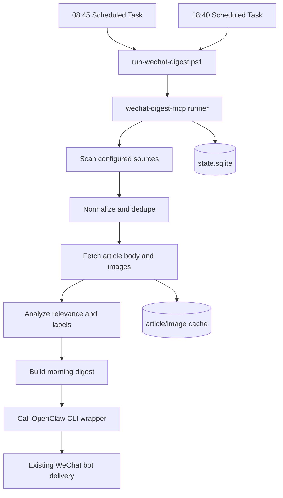

# Wechat Digest Architecture

This repository hosts Aaron's custom MCP services. The first production service is `wechat-digest-mcp`.

## Current tracked sources

- 新智元
- 机器之心
- 量子位
- 开源星探

## Runtime split

- `self-mcp`
  Owns deterministic business logic: source discovery, article extraction, deduplication, image extraction, analysis, labels, digest assembly, learning candidates, overlay rules, and delivery bookkeeping.
- `one-company / OpenClaw`
  Owns the conversational layer: the WeChat bot channel, persona, existing memory, optional interactive MCP use, and owner approvals sent from WeChat chat.
- Windows Scheduled Task
  Owns the production triggers at `08:45 Asia/Shanghai` for the morning digest, `18:40 Asia/Shanghai` for the evening digest, and `19:30 Asia/Shanghai` for learning follow-up reminders.

## Production flow

## Why MCP here

- The digest pipeline is stateful and deterministic.
- It needs persistent discovery state, retries, deduplication, and delivery records.
- It should stay decoupled from OpenClaw core updates.
- The same MCP can later expose more services without changing the OpenClaw runtime model.

## Why production scheduling stays outside OpenClaw cron

- OpenClaw can call MCP interactively.
- For production, `cron -> agent -> model decides whether to call tools` is less reliable than a direct deterministic runner.
- The current design keeps OpenClaw as the delivery and interaction layer, while `self-mcp` owns the hard business path.
